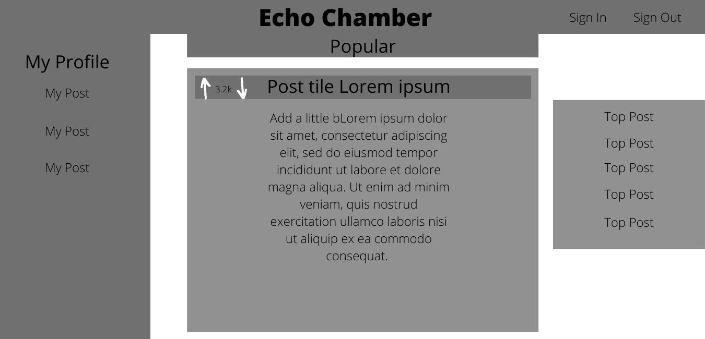

<h1>Week 15 - Project 2 - UW Coding Bootcamp</h1> <br>

Team 
```
Leona, Zakk, Evan, Elliott
```
Project Name:
```
ECHO CHAMBER
```

Description:
```
A social media platform that uses node, express, mysql, sequelize, and handlebars as the primary 
tools to connect users in an anonymous form. Users can create posts and then vote on posts to decide 
what makes it to the top of the feed. Users will have their own profiles to review their post history 
and can also comment on posts.
```

User Story: 
```
AS someone active in social media
I WANT to connect with others from other parts of the country and world 
AS WELL AS share common likes and dislikes of various topics 
SO THAT I can expand my community and strengthen my connection with others
```

Workflow:
```
GIVEN a social media site

WHEN I visit the site for the first time
THEN I am presented with the homepage, which has exsiting posts. I have navigation links to the homepage, 
login and signup pages.

WHEN I click the Home link
THEN I am taken to the homepage

WHEN I click on Sign Up
THEN I am taken to a page to sign up

WHEN I choose to sign up
THEN I am prompted to enter an email, password, and choose a unique username

WHEN I click on the 'signup' button
THEN me user credentials are saved and I am logged into the site

WHEN I revist the site at a later time and choose to sign in
THEN I am prompted to enter my username and password

WHEN I am signed into the site
THEN I am redirected to the homepage with new links for Logout and Profile

WHEN I am on the home page and click on a post
THEN I am taking to the post's page and can view comments and create my own comments.

WHEN I am on the home page and signed in I can click the create post button
THEN I am taken to a page where I can create a post with a subject and body with a submit post button

WHEN I click sumbit post
THEN I am taken to my post's own page and it is also sent to the homepage and my profile

WHEN I choose Profile
THEN I am taken to my own profile page with my user info, comment/post history and delete post button.

WHEN I click the delete post button
THEN my post is deleted from the database

WHEN I am on a post's page
THEN I can click the create comment button.

WHEN I click the create comment button
THEN I am taken to a page with the post name and body, and a text field for my comment with a post 
comment button

WHEN I click the post comment button
THEN I am redirected to the post's page and my comment is added

WHEN I choose logout
THEN I am logged out
```

Technologies Used:
```
Node
Express
MySQL
Sequelize
Handlebars
Materialize CSS
Mulzr (TBD)
```

Wireframe:
